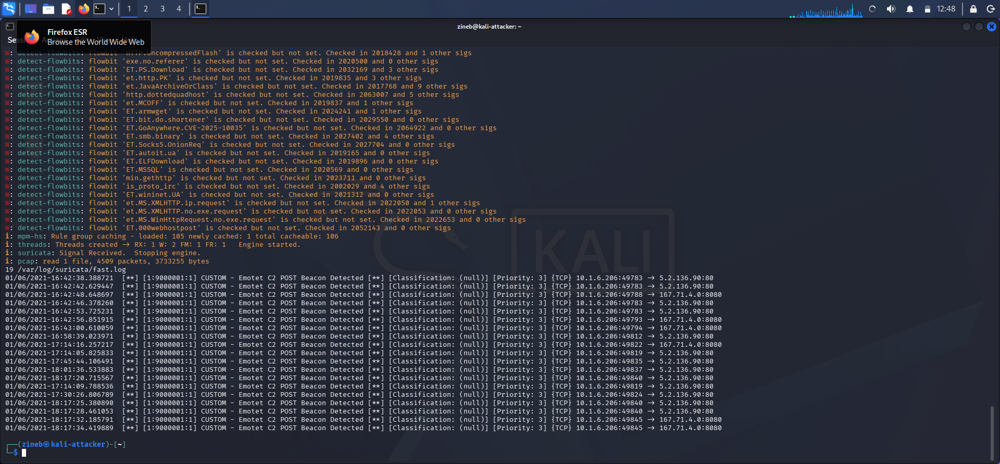
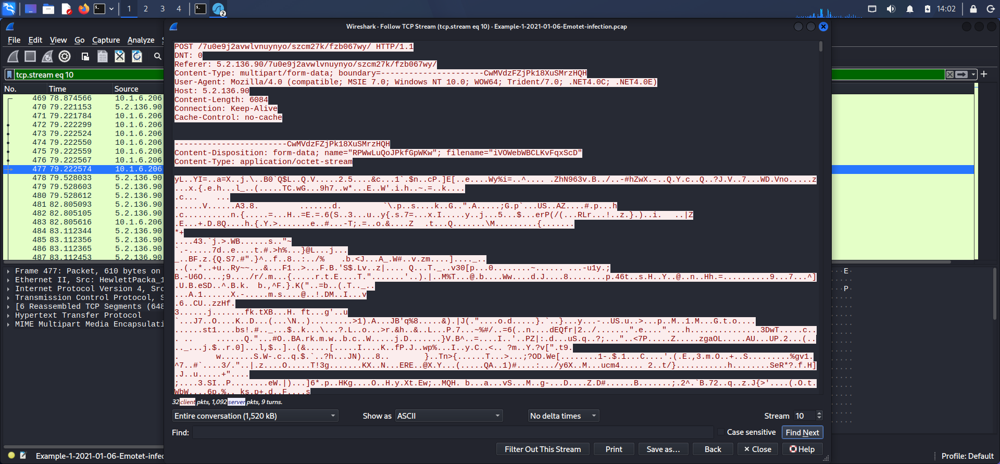
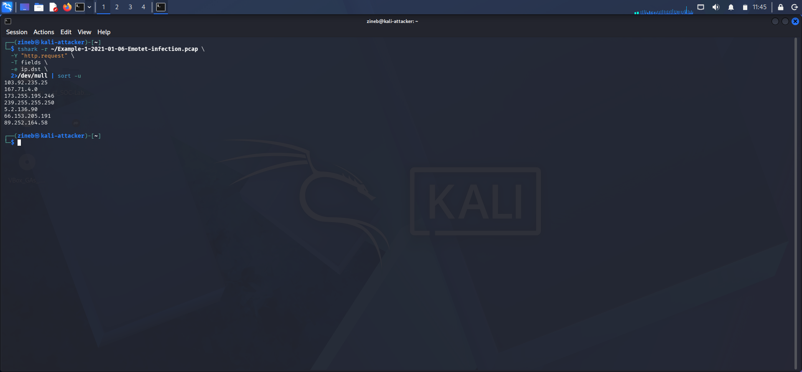
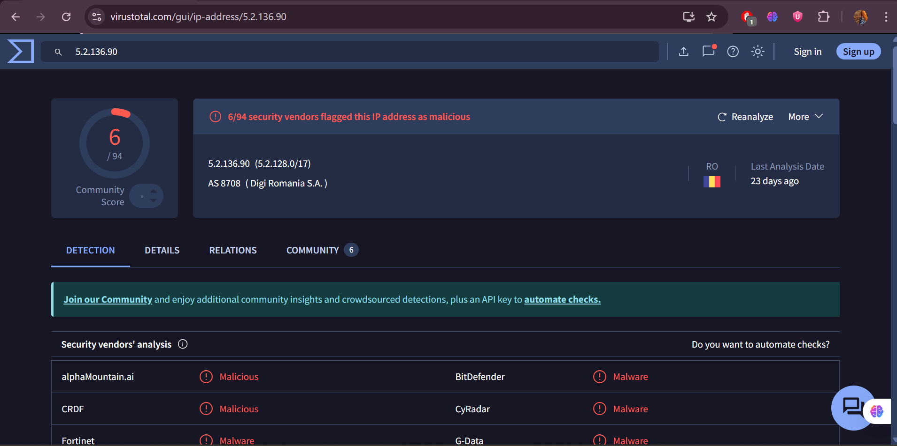
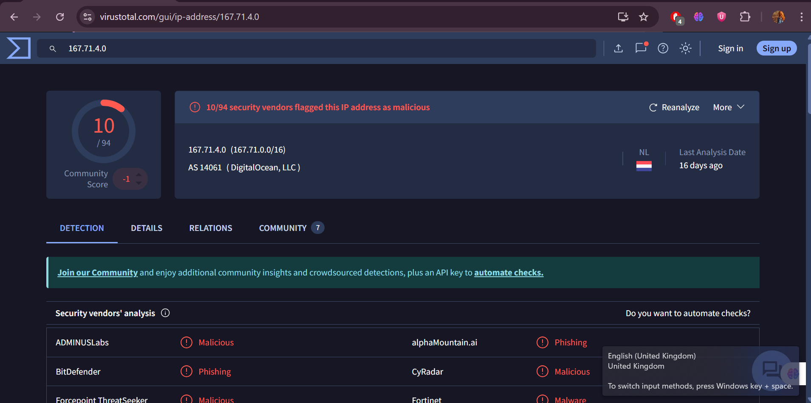
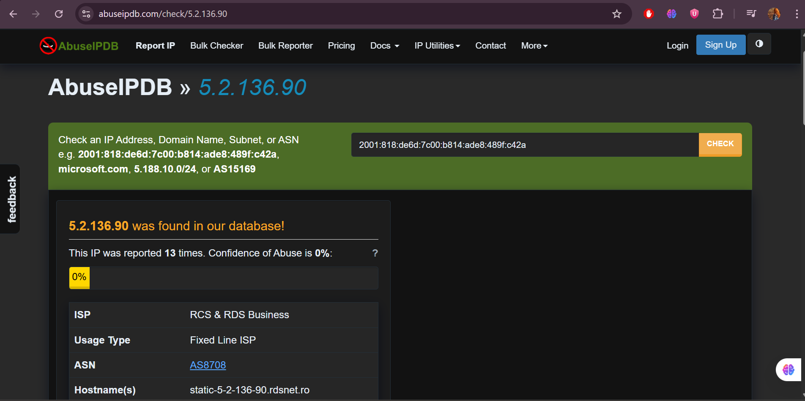

# Network Intrusion Detection with Suricata + Emotet PCAP Analysis

## 1. Objective

This project demonstrates a network intrusion detection and traffic analysis 
workflow using Suricata IDS and Wireshark. A real-world Emotet malware PCAP 
was analyzed to detect Command & Control (C2) communication, extract IOCs 
using tshark, and map attacker behavior to the MITRE ATT&CK framework.

---

## 2. Lab Setup

| Component | Details |
|---|---|
| OS | Kali Linux (VirtualBox) |
| IDS | Suricata 8.0.3 |
| Analysis Tools | Wireshark, tshark |
| PCAP Source | pan-unit42 — Emotet infection 2021-01-06 |
| Threat Intel | VirusTotal, AbuseIPDB |

---

## 3. Attack Overview

Emotet is a banking trojan first identified in 2014, widely considered one of 
the most dangerous and destructive malware families ever documented. It spreads 
through phishing emails containing malicious Word document attachments. Once 
executed, it steals credentials, downloads secondary payloads, and establishes 
persistent communication with attacker-controlled C2 servers using HTTP-based 
beaconing. In January 2021 — the same month as this PCAP — Emotet's 
infrastructure was taken down by a coordinated international law enforcement 
operation, making this capture a historically significant sample.

---

## 4. Analysis Process

1. Installed and configured Suricata 8.0.3 on Kali Linux
2. Downloaded real Emotet infection PCAP from the pan-unit42 research repository
3. Ran Suricata against the PCAP to generate detection alerts
4. Analyzed HTTP traffic using tshark to identify C2 communication patterns
5. Observed repeated POST requests to randomly generated URLs — confirmed 
   Emotet C2 beaconing behavior
6. Wrote a custom Suricata rule targeting the C2 URL pattern
7. Rule fired **19 alerts** confirming active C2 communication



8. Reconstructed TCP streams in Wireshark to inspect malware payload content



9. Extracted all destination IPs from the PCAP using tshark
10. Validated suspicious IPs on VirusTotal and AbuseIPDB

---

## 5. Custom Suricata Rule
```suricata
alert http any any -> any any (
  msg:"CUSTOM - Emotet C2 POST Beacon Detected";
  flow:established,to_server;
  content:"POST";
  http_method;
  pcre:"/^\/[a-z0-9]{4,20}\/[a-z0-9]{4,20}\//Ui";
  sid:9000001;
  rev:1;
)
```

**Why this rule works:**
Emotet generates randomized multi-segment URL paths (e.g., `/abc123/def456/`) 
for each C2 session to evade static signature-based detection. Instead of 
matching a fixed URL, this rule targets the structural pattern of those paths 
using a regex-based approach — the difference between reactive detection 
(blocking known bad URLs) and behavioral detection (identifying the technique 
itself). This allows detection of Emotet traffic regardless of the specific 
URL used. During analysis, the rule successfully triggered 19 alerts across 
two confirmed C2 servers, validating its effectiveness.

The full rule file is available in the `/rules` folder.

---

## 6. IOCs (Indicators of Compromise)

The following IOCs were extracted from the PCAP and validated using external threat intelligence sources.



| Type | Value | Verdict | Source |
|------|-------|---------|--------|
| IP | 5.2.136.90 | **Malicious** | VirusTotal 6/94, AbuseIPDB — RO |
| IP | 167.71.4.0 | **Malicious** | VirusTotal 10/94 — DigitalOcean NL |
| IP | 103.92.235.25 | Suspected C2 | PCAP analysis |
| IP | 89.252.164.58 | Suspected C2 | PCAP analysis |
| IP | 173.255.195.246 | Suspected C2 | PCAP analysis |
| URL | /7u0e9j2avwlvnuynyo/szcm27k/fzb067wy/ | C2 endpoint | HTTP stream |
| URL | /ko5ezxmguvv/p8d4003oiu/utkdae7r/74uzr8n74r/ | C2 endpoint | HTTP stream |







The full IOC list is available in the `/iocs` folder.

---

## 7. MITRE ATT&CK Mapping

| Technique ID | Name | Evidence Observed |
|---|---|---|
| T1071.001 | Application Layer Protocol: Web Protocols | Emotet used HTTP POST requests for all C2 communication |
| T1571 | Non-Standard Port | C2 traffic observed on port 8080 to 167.71.4.0 |
| T1036 | Masquerading | Fake Internet Explorer User-Agent string used to blend with normal traffic |
| T1102 | Web Service | C2 traffic routed through compromised legitimate WordPress sites |
| T1041 | Exfiltration Over C2 Channel | Encrypted binary payload sent to C2 server via HTTP POST |

---

## 8. Incident Report

**Victim Host:** 10.1.6.206
**Date:** 2021-01-06
**Malware Family:** Emotet
**Detection Method:** Suricata IDS + tshark traffic analysis

**Timeline of Events**

| Time | Event |
|------|-------|
| 16:41 UTC | First C2 beacon observed — 10.1.6.206 → 5.2.136.90:80 |
| 16:42 UTC | Multiple POST requests confirmed to random C2 URLs |
| 17:14 UTC | Additional C2 communication observed — 167.71.4.0:8080 |
| 18:17 UTC | Last recorded C2 beacon in the capture |

**Malware Activity**

The infected host at 10.1.6.206 was actively beaconing to two confirmed 
C2 servers using HTTP POST requests with randomly generated URL paths. 
The TCP stream analysis revealed multipart form-data payloads containing 
encrypted binary content — consistent with Emotet data exfiltration and 
command retrieval behavior. The malware used a spoofed Internet Explorer 
User-Agent string to disguise its traffic as legitimate browser activity.

**Recommendations**

1. Isolate host 10.1.6.206 from the network immediately
2. Block C2 IPs at perimeter firewall: 5.2.136.90, 167.71.4.0
3. Hunt across all network logs for connections to identified C2 IPs
4. Review endpoint logs for persistence mechanisms and lateral movement
5. Reimage the infected machine and reset all credentials
6. Deploy the custom Suricata rule from this project to detect similar 
   beaconing behavior across the environment

---

## 9. Detection Gap Analysis

The default Suricata ruleset (435 rules) produced only 1 alert against 
this traffic. The custom rule targeting Emotet's URL structure produced 
19 alerts — demonstrating that generic rulesets miss behavioral patterns 
that analyst-written rules can catch. This highlights the importance of 
custom detection engineering over relying solely on vendor-provided signatures.

---


## 10. Key Skills Demonstrated

- Network intrusion detection with Suricata IDS
- PCAP forensic analysis using Wireshark and tshark
- Malware C2 traffic identification and behavioral analysis
- Custom IDS rule development based on observed traffic patterns
- IOC extraction and threat intelligence validation
- VirusTotal and AbuseIPDB investigation
- MITRE ATT&CK threat mapping
- SOC-style incident documentation and reporting


